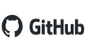

# Python Course Repository

Welcome to the Python Course repository! This repository is designed to provide a comprehensive Python programming course for beginners. 
Whether you're new to programming or have some experience, this course will help you learn and improve your Python skills.

**Happy coding and enjoy the Python course!**

## Table of Contents
- [Contributing](#contributing)
- [Introduction](#about-python)
- [Getting Started](#getting-started)
- [Course Overview](#course-overview)
- [Course Structure](#course-structure)

## Contributing

We welcome contributions to this Python course repository. If you find any issues, have suggestions for improvements, 
or want to add new content, please feel free to open an issue. Your contributions will help make this course even better for future learners.

Support me to create more educational materials

Author: Sergi Felip Ribas

<p align="center">
    <a href="https://paypal.me/sergifelipribas"></a>
    <a href="https://github.com/sergif-github"></a>
    <a href="https://www.linkedin.com/in/sergifelipribas/"></a>
</p>

## About Python

Python is a programming language which is very close to human language and because of that it is easy to learn and use.
Python is used by various industries and companies. It has been used to develop web applications, desktop applications,
system administration, and machine learning libraries. Python is highly embraced language in the data science and machine learning community.
I hope this is enough to convince you to start learning Python. Python is eating the world and you are killing it before it eats you.

Python is a high-level, interpreted, general-purpose, and cross-platform programming language. It was created by Guido van Rossum in 1989.
It is used to develop different types of applications such as web applications, desktop software, data analysis, artificial intelligence,
and automation. It is one of the most popular languages in the development community due to its easy and readable syntax,
large number of available libraries and resources, and ease of learning.

Python is an interpreted programming language. In this case we need an interpreter in charge of reading the source code,
interpreting it and executing it. As opposed to compiled languages like C or C++ where code is translated into 
machine code through a compiler before being executed. The interpreted language allows us more flexibility although it generally
tends to be slower and less secure than the compiled language. Python has its own default interpreter called "Python interpreter".

Python can be executed from the command line and is the one used by different IDEs by default. Additionally, there are other interpreters
such as IPython and Jupyter that provide more interactivity and "shell-like" and "notebook-like" environments to run Python code.
The development environments (IDEs) most used to develop Python are: PyCharm, Spyder, Eclipse with the PyDev plugin, 
Visual Studio Code and Jupyter Notebook. Among its large number of libraries, the following stand out: NumPy, Pandas, 
Matplotlib, Scikit-learn, TensorFlow, Keras and PyTorch.

## Getting Started

To get started with this Python course, you'll need the following prerequisites:

- A basic understanding of programming concepts (though no prior experience with Python is required)
- Python installed on your local machine (preferably >= Python 3.6)
- (Optional) An IDE such as PyCharm or Visual Studio Code to easy programming

To install Python, you can download it from the official Python website at [python.org](https://www.python.org/) and follow the installation
instructions specific to your operating system.

To install PyCharm, you can download it from the official PyCharm website at [jetbrains.com](https://www.jetbrains.com/pycharm/) and follow the installation
instructions specific to your operating system.

Once you have Python installed, you can clone this repository to your local machine using the following command:

```
git clone https://github.com/sergif-github/python-course.git
```

This repository was created using Python 3.9.7 and the PyCharm IDE.

## Course Overview

This Python course is designed to introduce you to the fundamentals of programming using the Python programming language. 
The course covers a wide range of topics, starting from the basics and gradually progressing to more advanced concepts.

Here are some of the key topics covered in this course:
- Introduction to Python
- Basic objects, statements, and data types
- Basic operators
- Control flow statements
- Loops
- Methods and functions
- Object-oriented programming (OOP) principles
- Exception handling
- Modules and packages
- File handling
- Additional Python modules and libraries
- Advanced concepts
- Testing and debugging

The course is structured in a way that each topic builds upon the previous ones, providing a logical progression of learning. 
Each topic includes theory explanations, practical examples, and exercises to reinforce your understanding.

The goal of this course is to cover foundational aspects of Python programming with an emphasis on script writing,
basic data manipulation, and program organization.  By the end of this course, students should be able to start writing 
useful Python programs on their own or be able to understand and modify Python code written by their coworkers.


## Course Structure

The course is organized into different modules, each covering a specific topic. Inside the repository, you'll find the following structure:

This Python course covers the following topics:

**[Module 0: Introduction to Python](./00-Introduction%20to%20Python)**
   - [Introduction and installing Python](./00-Introduction%20to%20Python/01_introduction_python.md)
   - [Running Python programs](./00-Introduction%20to%20Python/02_running_python_programs.md)
   - [Basic syntax and indentation](./00-Introduction%20to%20Python/03_basic_syntax_and_identation.md)
   - [Printing and commenting code](./00-Introduction%20to%20Python/04_printing_and_commenting_code.md)
   - [User input](./00-Introduction%20to%20Python/05_user_input.md)

**[Module 1: Variables and Data Types](./01-Variables%20and%20Data%20Types)**
   - [Variables and assignments](./01-Variables%20and%20Data%20Types/01_variables_and_assignments.md)
   - [Numeric data types (int, float)](./01-Variables%20and%20Data%20Types/02_numeric_data_types.md)
   - [Strings and string manipulation](./01-Variables%20and%20Data%20Types/03_string_and_manipulation.md)
   - [Boolean data type](./01-Variables%20and%20Data%20Types/04_boolean_data_types.md)
   - [Type conversion and casting](./01-Variables%20and%20Data%20Types/05_type_conversion_and_casting.md)
   - [Working with collections (lists, tuples, dictionaries, sets)](./01-Variables%20and%20Data%20Types/06_collections.md)

**[Module 2: Operators](./02-Operators)**
   - [Arithmetic operators](02-Operators/01_arithmetic_operators.md)
   - [Comparison operators](02-Operators/02_comparison_operators.md)
   - [Logical operators](02-Operators/03_logical_operators.md)
   - [Assignment operators](02-Operators/04_assignment_operators.md)
   - [Bitwise operators](02-Operators/05_bitwise%20operators.md)
   - [Operator precedence](02-Operators/06_operator_precedence.md)

**[Module 3: Control Flow Statements](./03-Control%20Flow%20Statements)**
   - [Conditional statements (if, else, elif)](./03-Control%20Flow%20Statements/01_conditional_statements.md)
   - [Nested conditionals](./03-Control%20Flow%20Statements/02_nested_conditionals.md)
   - [Logical operators in conditionals](./03-Control%20Flow%20Statements/03_logical_operators_in_conditionals.md)
   - [The ternary operator](./03-Control%20Flow%20Statements/04_the_therany_operator.md)

**[Module 4: Loops](./04-Loops)**
   - [While loop](04-Loops/01_while_loop.md)
   - [For loop](04-Loops/02_for_loop.md)
   - [Loop control statements (break, continue)](04-Loops/03_loop_control_statements.md)
   - [Nested loops](04-Loops/04_nested_loops.md)
   - [Looping through collections](04-Loops/05_looping_collections.md)

**[Module 5: Methods and Functions](./05-Methods%20and%20Functions)**
   - [Defining and calling functions](./05-Methods%20and%20Functions/01_define_and_call_functions.md)
   - [Function parameters and arguments](./05-Methods%20and%20Functions/02_parameters_and_arguments.md)
   - [Variable scope and global keyword](./05-Methods%20and%20Functions/03_scope_and_global_keyword.md)
   - [Returning values from functions](./05-Methods%20and%20Functions/04_return_values.md)
   - [Recursive functions](./05-Methods%20and%20Functions/05_recursive_functions.md)

**[Module 6: Object-Oriented Programming](./06-Object-Oriented%20Programming)**
   - [Introduction to classes and objects](06-Object-Oriented%20Programming/01_introduction.md)
   - [Class attributes and instance attributes](./06-Object-Oriented%20Programming/02_class_atributes_and_instance_atributes.md)
   - [Class methods and static methods](./06-Object-Oriented%20Programming/03_class_methods_and_data_abstraction.md)
   - [Encapsulation and data abstraction](./06-Object-Oriented%20Programming/04_encapsulation_and_data_abstraction.md)
   - [Inheritance and polymorphism](./06-Object-Oriented%20Programming/05_inheritance_and_polymorphism.md)
   - [Special Python methods (dunder methods)](./06-Object-Oriented%20Programming/06_special_python_methods.md)

**[Module 7: Exception Handling](./07-Exception%20Handling)**
   - [Understanding exceptions](./07-Exception%20Handling/01_understanding_exceptions.md)
   - [Handling exceptions using try-except blocks](./07-Exception%20Handling/02_handling_exceptions_using_try-except_block.md)
   - [Catching specific exceptions](./07-Exception%20Handling/03_catching_specific_exceptions.md)
   - [Raising exceptions](./07-Exception%20Handling/04_raising_exceptions.md)

**[Module 8: Modules and Packages](./08-Modules%20and%20Packages)**
   - [Importing and using modules](./08-Modules%20and%20Packages/01_importing_and_using_modules.md)
   - [Creating and organizing packages](./08-Modules%20and%20Packages/02_creating_and_organizing_packages.md)
   - [Exploring the Python Standard Library](./08-Modules%20and%20Packages/03_python_standard_library.md)

**[Module 9: File Handling and Manipulation](./09-File%20Handling%20and%20Manipulation)**
    - [Reading and writing text files](./09-File%20Handling%20and%20Manipulation/01_reading_and_writing_files.md)
    - [Working with file objects](./09-File%20Handling%20and%20Manipulation/02_working_with_file_objects.md)
    - [File modes and file paths](./09-File%20Handling%20and%20Manipulation/03_csv_and_json_files.md)
    - [CSV and JSON file processing](./09-File%20Handling%20and%20Manipulation/04_file_modes_and_paths.md)
    - [Error handling with files](./09-File%20Handling%20and%20Manipulation/05_error_handling_with_files.md)

**[Module 10: Additional Python Modules and Libraries](./10-Additional%20Python%20Modules%20and%20Libraries)**
    - [Dates and times manipulation (datetime module)](./10-Additional%20Python%20Modules%20and%20Libraries/01_datetime_module.md)
    - [Mathematical operations (math module)](./10-Additional%20Python%20Modules%20and%20Libraries/02_math_module.md)
    - [Generating random numbers (random module)](./10-Additional%20Python%20Modules%20and%20Libraries/03_random_module.md)
    - [Working with images (Pillow module)](./10-Additional%20Python%20Modules%20and%20Libraries/04_pillow_module.md)
    - [Zip files (zipfile module)](./10-Additional%20Python%20Modules%20and%20Libraries/05_zipfile_module.md)
    - [Regular expressions (re module)](./10-Additional%20Python%20Modules%20and%20Libraries/06_re_module.md)

**[Module 11: Advanced Concepts](./11-Advanced%20Concepts)**
    - [Decorators (function decorators and class decorators)](./11-Advanced%20Concepts/01_decorators.md)
    - [Iterators and generators](./11-Advanced%20Concepts/02_iterators_and_generators.md)
    - [Recursion](./11-Advanced%20Concepts/03_recursion.md)
    - [Debugging with the debugger](./11-Advanced%20Concepts/03_recursion.md)
    - [Code timing and optimization](./11-Advanced%20Concepts/04_debugging.md)

**[Module 12: Testing and Debugging](./12-Testing%20and%20Debugging)**
    - [Unit testing with unittest module](./12-Testing%20and%20Debugging/01_unitest_module.md)
    - [Test-driven development](./12-Testing%20and%20Debugging/02_test_driven_development.md)
    - [Debugging techniques and strategies](./12-Testing%20and%20Debugging/03_debugging_techniques_and_strategies.md)
    - [Handling common errors](./12-Testing%20and%20Debugging/04_handling_common_errors.md)

You can start with the first module and progress through the course at your own pace. Make sure to read the lecture notes, 
try out the examples, and complete the exercises to solidify your knowledge.
